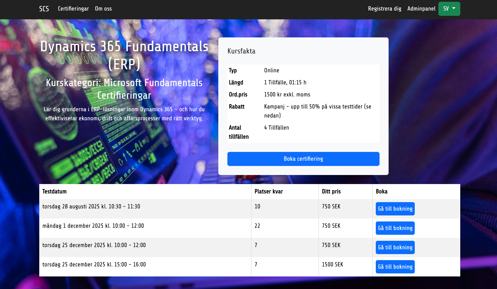
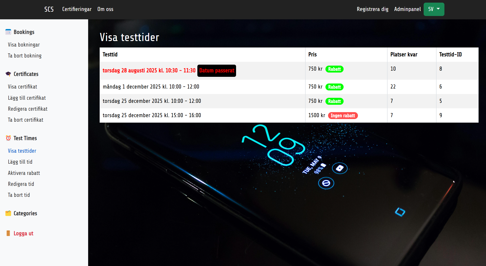

# A simple frontend

I am currently developing a full-stack online booking platform tailored for IT certification exams. The platform also facilitates the sale of related products such as training materials, practice tests, and certification vouchers.

## Screenshots

Here are some screenshots of the project:

---

Key features include:

Multilingual support: Swedish (primary), Danish, Norwegian, and Finnish, with an efficient, cost-effective machine translation solution for localization.

Secure user authentication system: Ensuring safe access and user management.

Payment processing integration: Using Stripe to handle transactions smoothly and securely.

Admin panel development: For easy management of bookings, products, and content.

Dynamic data handling: Through RESTful APIs, enabling responsive frontend-backend communication.

Initially, the project focused on frontend development with React. Over time, I expanded my role to full-stack responsibilities, managing both frontend and server development. This experience has strengthened my ability to independently deliver complete web solutions — from intuitive UI/UX design to robust server-side logic — efficiently and reliably.

To install, run this command from CLI
 - npm install 

To run for development purpose, use this command from CLI
 - npm run dev

To build the application, use this command from CLI
 - npm run build

 To lint the application, use this command from CLI
 - npm run lint

 To run the application, use this command from CLI
 - npm run preview
 

 © 2025 Viktor Ciganovic. All rights reserved.